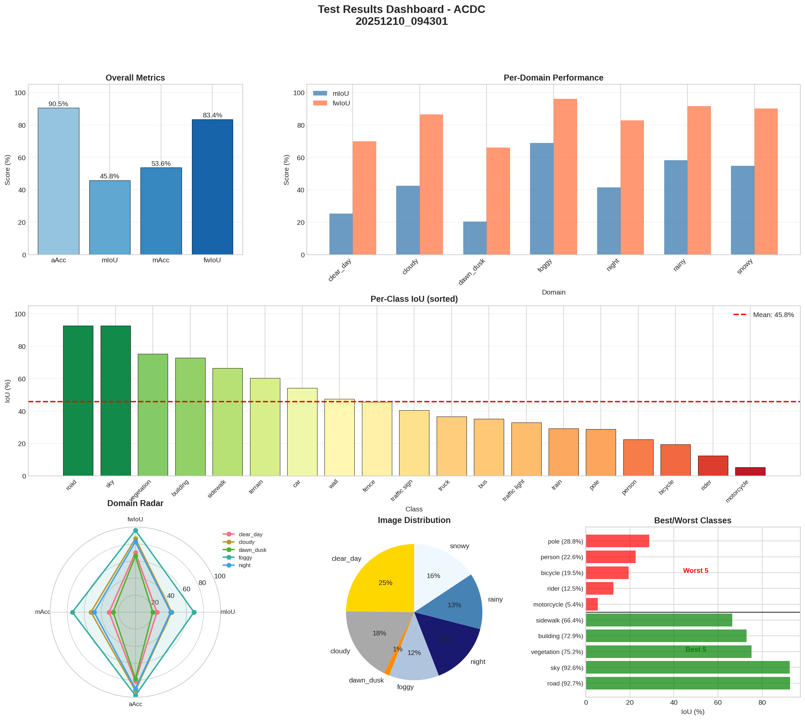

# PROVE: Pipeline for Recognition & Object Vision Evaluation

## Overview

PROVE (Pipeline for Recognition & Object Vision Evaluation) is a comprehensive, streamlined pipeline for training and testing object detection and semantic segmentation approaches using the MMDetection framework. The pipeline provides standardized configuration management and supports multiple dataset formats with easy reproducibility.

## Features

### Supported Tasks
- **Object Detection**: Real-time detection and localization of objects in images
- **Semantic Segmentation**: Pixel-level classification of image regions
- **Joint Training**: Unified training on multiple datasets (Cityscapes + Mapillary Vistas)

### Supported Dataset Formats
- **Object Detection**: BDD100k JSON format, COCO JSON format
- **Semantic Segmentation**: Cityscapes, Mapillary Vistas, OUTSIDE15k formats
- **Joint Training**: Combined Cityscapes + Mapillary Vistas with label unification

### Label Unification
PROVE includes a comprehensive label unification strategy that enables joint training of Cityscapes and Mapillary Vistas datasets:

- **Cityscapes Label Space (19 classes)**: Standard Cityscapes format, ideal for benchmarking
- **Unified Label Space (42 classes)**: Extended format preserving more semantic information from both datasets

### Key Benefits
- **Reproducible Experiments**: Config-driven approach ensures consistent results
- **Format Standardization**: Automatic conversion between dataset formats
- **Label Unification**: Seamless joint training across different datasets
- **Model Flexibility**: Support for multiple state-of-the-art architectures
- **Easy Configuration**: Template-based configuration generation
- **Comprehensive Logging**: Detailed logging and experiment tracking

## Installation

### Prerequisites
- Python 3.10+
- PyTorch 2.1+
- CUDA 11.8+ (recommended for GPU acceleration)
- Mamba or Conda package manager

### Quick Setup with Mamba (Recommended)

The easiest way to set up PROVE is using the provided environment file:

```bash
# Clone repository
git clone https://github.com/carhartt21/PROVE.git
cd PROVE

# Create mamba environment
mamba env create -f environment.yml

# Activate environment
mamba activate prove

# Verify installation
python -c "import torch; print(f'PyTorch: {torch.__version__}')"
python -c "import mmseg; print(f'MMSeg: {mmseg.__version__}')"
```

### Manual Installation

**Important**: OpenMMLab packages have complex version interdependencies. The versions below represent a known working combination.

```bash
# Create environment
mamba create -n prove python=3.10 -y
mamba activate prove

# Install PyTorch with CUDA 11.8
mamba install pytorch=2.1.2 torchvision pytorch-cuda=11.8 -c pytorch -c nvidia -y

# Install MMCV with compiled extensions (requires conda/mamba)
mamba install -c conda-forge mmcv=2.1.0 -y

# Install MMEngine and OpenMMLab packages
pip install mmengine==0.10.7
pip install mmsegmentation==1.2.2 mmdet==3.3.0

# Install additional dependencies
pip install ftfy regex tqdm
```

**Tested Working Versions:**
- PyTorch 2.1.2 with CUDA 11.8
- MMCV 2.1.0
- MMEngine 0.10.7
- MMSegmentation 1.2.2
- MMDetection 3.3.0

**Version Compatibility Notes:**
- **MMCV 2.x**: Requires compiled CUDA extensions not available in pip. Use conda for full functionality.
- **MMSegmentation 1.2.x**: Latest features but requires MMCV 2.x
- **MMDetection 3.3.x**: Latest object detection models and features
- **Legacy versions**: More stable but missing newer architectures and optimizations

### Verify Installation

```bash
# Test that all components work
python -c "
import torch
import mmcv
import mmseg
import mmdet
print('All imports successful!')
print(f'PyTorch: {torch.__version__}')
print(f'CUDA available: {torch.cuda.is_available()}')
print(f'MMCV: {mmcv.__version__}')
print(f'MMSeg: {mmseg.__version__}')
print(f'MMDet: {mmdet.__version__}')
"
```

## Quick Start

### 1. Training with Unified System (Recommended)

PROVE now includes a unified training system that simplifies configuration management and supports mixed real/generated image training:

```bash
# Basic training with baseline (no augmentation)
python unified_training.py --dataset ACDC --model deeplabv3plus_r50 --strategy baseline

# Training on specific domain (e.g., clear weather only)
python unified_training.py --dataset ACDC --model deeplabv3plus_r50 --strategy baseline --domain-filter clear_day

# Training with generated image augmentation (cycleGAN)
python unified_training.py --dataset ACDC --model deeplabv3plus_r50 --strategy gen_cycleGAN

# Mixed training with 50% real, 50% generated images
python unified_training.py --dataset ACDC --model deeplabv3plus_r50 --strategy gen_cycleGAN --real-gen-ratio 0.5

# Training with standard augmentation (CutMix, MixUp, etc.)
python unified_training.py --dataset ACDC --model deeplabv3plus_r50 --strategy std_cutmix

# Combined strategies: generative augmentation + standard augmentation
python unified_training.py --dataset ACDC --model deeplabv3plus_r50 --strategy gen_cycleGAN --std-strategy std_cutmix

# Specify custom cache directory for pretrained weights
python unified_training.py --dataset ACDC --model deeplabv3plus_r50 --strategy baseline --cache-dir /path/to/cache

# Batch training for multiple configurations
python unified_training.py --batch --datasets ACDC BDD10k --strategies baseline gen_cycleGAN

# Batch training for all segmentation datasets and models
python unified_training.py --batch --all-seg-datasets --all-seg-models --strategies baseline

# Batch training for all detection datasets and models
python unified_training.py --batch --all-det-datasets --all-det-models --strategies baseline

# Dry run to preview batch training commands
python unified_training.py --batch --all-seg-datasets --all-seg-models --dry-run

# List all available options
python unified_training.py --list
```

#### Training Options

| Option | Description | Default |
|--------|-------------|---------|
| `--dataset` | Dataset name (ACDC, BDD10k, BDD100k, IDD-AW, MapillaryVistas, OUTSIDE15k) | Required |
| `--model` | Model name (deeplabv3plus_r50, pspnet_r50, segformer_mit-b5, segnext_mscan-b, etc.) | Required |
| `--strategy` | Main augmentation strategy (baseline, std_cutmix, gen_cycleGAN, etc.) | baseline |
| `--std-strategy` | Standard augmentation to combine with main strategy (see Combined Strategies) | None |
| `--real-gen-ratio` | Ratio of real to generated images (0.0 to 1.0) | 1.0 |
| `--domain-filter` | Filter training data to specific domain (e.g., clear_day for Stage 1 training) | None |
| `--work-dir` | Output directory for checkpoints and logs | Auto-generated |
| `--cache-dir` | Directory for caching pretrained weights and checkpoints | ~/.cache/torch |
| `--load-from` | Path to pretrained weights to initialize model | None |
| `--resume-from` | Path to checkpoint to resume training from | None |
| `--max-iters` | Maximum training iterations | 15000 (seg) / 10000 (det) |
| `--checkpoint-interval` | Save checkpoint every N iterations | 2000 |
| `--eval-interval` | Run validation every N iterations | 2000 |
| `--batch-size` | Training batch size (LR auto-scales with linear scaling rule) | 16 |
| `--no-early-stop` | Disable early stopping (stops when no improvement for 5 validations) | Enabled |
| `--early-stop-patience` | Number of validations without improvement before stopping | 5 |
| `--use-native-classes` | Use native labels (66 for Mapillary, 24 for OUTSIDE15k) instead of Cityscapes 19 | False |
| `--aux-loss` | Auxiliary loss to add alongside CrossEntropyLoss (`focal`, `lovasz`, `boundary`) | None |
| `--save-val-predictions` | Save validation visualizations (Input \| GT \| Prediction side-by-side) | False |
| `--max-val-samples` | Maximum number of samples to visualize per validation epoch | 5 |

**Important Training Modes:**

```bash
# Stage 1 Training: Clear-day only (domain-filtered)
python unified_training.py --dataset BDD10k --model segformer_mit-b5 \
    --strategy gen_cycleGAN --domain-filter clear_day

# Stage 2 Training: All domains  
python unified_training.py --dataset BDD10k --model segformer_mit-b5 \
    --strategy gen_cycleGAN

# Extended Training: Longer training with no early stopping
python unified_training.py --dataset BDD10k --model segformer_mit-b5 \
    --strategy gen_cycleGAN --max-iters 320000 --no-early-stop

# Resume from checkpoint
python unified_training.py --dataset BDD10k --model segformer_mit-b5 \
    --strategy gen_cycleGAN --resume-from /path/to/iter_80000.pth --max-iters 160000

# Training with auxiliary loss (CE remains primary)
python unified_training.py --dataset BDD10k --model deeplabv3plus_r50 \
    --strategy baseline --aux-loss focal

# Training with validation visualization (saves Input | GT | Prediction images)
python unified_training.py --dataset BDD10k --model deeplabv3plus_r50 \
    --strategy baseline --save-val-predictions --max-val-samples 10
```

#### Combined Strategies
You can combine standard augmentation strategies (std_*) with generative augmentation strategies (gen_*) or baseline using the `--std-strategy` option. This enables applying both types of augmentation during training.

**Available Standard Augmentations for `--std-strategy`:**
- `std_cutmix` - CutMix augmentation
- `std_mixup` - MixUp augmentation
- `std_autoaugment` - AutoAugment policy
- `std_randaugment` - RandAugment augmentation

**Usage Examples:**

```bash
# Combine generative augmentation (cycleGAN) with CutMix
python unified_training.py --dataset ACDC --model deeplabv3plus_r50 \
    --strategy gen_cycleGAN --std-strategy std_cutmix

# Combine baseline training with MixUp augmentation
python unified_training.py --dataset ACDC --model deeplabv3plus_r50 \
    --strategy baseline --std-strategy std_mixup

# Multi-dataset training with combined strategies
python unified_training.py --multi-dataset --datasets ACDC MapillaryVistas \
    --model deeplabv3plus_r50 --strategy gen_CUT --std-strategy std_autoaugment
```

**Output Directory Structure:**
When using combined strategies, the work directory includes both strategy names:
- `gen_cycleGAN+std_cutmix/acdc/deeplabv3plus_r50/`
- `baseline+std_mixup/acdc/deeplabv3plus_r50/`

**Batch Combination Training:**

For systematic ablation studies combining top gen and std strategies, use the combination training script:

```bash
# List all combinations (top 3 gen × top 3 std × datasets × models)
./scripts/submit_combination_training.sh --list

# Preview bsub commands without submitting
./scripts/submit_combination_training.sh --dry-run

# Submit all combination training jobs
./scripts/submit_combination_training.sh

# Submit with limit
./scripts/submit_combination_training.sh --limit 10
```

**Default Configuration:**
- Gen strategies: gen_cyclediffusion, gen_TSIT, gen_cycleGAN
- Std strategies: std_randaugment, std_mixup, std_cutmix
- Datasets: MapillaryVistas, IDD-AW
- Models: SegFormer, PSPNet
- Total: 36 combinations (3 × 3 × 2 × 2)

**Shell Script Usage:**
```bash
# Using train_unified.sh
./scripts/train_unified.sh single --dataset ACDC --model deeplabv3plus_r50 \
    --strategy gen_cycleGAN --std-strategy std_cutmix

# Submit to LSF cluster
./scripts/train_unified.sh submit --dataset ACDC --model deeplabv3plus_r50 \
    --strategy gen_cycleGAN --std-strategy std_mixup
```

#### Early Stopping

Early stopping is enabled by default to prevent overfitting and save training time. It monitors:
- **Segmentation**: `val/mIoU` (validation mean Intersection over Union)
- **Detection**: `coco/bbox_mAP` (COCO bounding box mean Average Precision)

Training stops when the monitored metric doesn't improve by at least 0.001 for 5 consecutive validation steps.

#### Evaluation Metrics

For segmentation tasks, the following metrics are computed during validation and testing:

**Primary Metric: mIoU (Mean Intersection over Union)**
- Standard metric giving equal weight to all classes
- **Recommended for domain robustness analysis**
- Not biased by class frequency distribution

**Secondary Metric: fwIoU (Frequency Weighted IoU)**
- Weights each class IoU by its pixel frequency: `fwIoU = Σ(freq_i × IoU_i)`
- **NOT recommended for cross-domain comparison** (see note below)
- Useful for overall scene understanding when class distribution is relevant

**⚠️ Important: Why mIoU for Domain Analysis**

Our analysis revealed that fwIoU can be misleading for domain gap analysis:
- Adverse weather (fog, rain) naturally occludes small objects (people, cyclists)
- This shifts class distribution toward "easy" classes (road, sky)
- fwIoU artificially inflates performance on adverse domains
- **Example**: Foggy images showed +13% higher fwIoU than clear_day, but only -8.5% lower mIoU

**Baseline Domain Gap (Clear_Day Trained Models, mIoU)**:
| Condition | mIoU | Gap |
|-----------|------|-----|
| Normal (clear_day, cloudy) | 54.96% | - |
| Adverse (foggy, rainy, snowy, night) | 47.49% | -7.46% |

*Data filtered to domains with ≥50 test images for reliability.*

```bash
# Disable early stopping
python unified_training.py --dataset ACDC --model deeplabv3plus_r50 --no-early-stop

# Custom patience (stop after 10 validations without improvement)
python unified_training.py --dataset ACDC --model deeplabv3plus_r50 --early-stop-patience 10
```

#### Batch Training Options

| Option | Description |
|--------|-------------|
| `--batch` | Enable batch training mode |
| `--datasets` | List of datasets for batch training |
| `--models` | List of models for batch training |
| `--all-seg-datasets` | Use all segmentation datasets (ACDC, BDD10k, IDD-AW, MapillaryVistas, OUTSIDE15k) |
| `--all-det-datasets` | Use all detection datasets (BDD100k) |
| `--all-seg-models` | Use all segmentation models (deeplabv3plus_r50, pspnet_r50, segformer_mit-b5) |
| `--all-det-models` | Use all detection models (faster_rcnn_r50_fpn_1x, yolox_l, rtmdet_l) |
| `--strategies` | List of augmentation strategies for batch training |
| `--ratios` | List of real-to-generated ratios for batch training |
| `--parallel` | Run batch jobs in parallel |
| `--dry-run` | Preview commands without executing |

#### Multi-Dataset Joint Training

Train on multiple datasets simultaneously (e.g., ACDC + MapillaryVistas) with automatic label unification:

```bash
# Joint training on ACDC + Mapillary (labels unified automatically)
./scripts/train_unified.sh single-multi --datasets ACDC MapillaryVistas --model deeplabv3plus_r50

# With custom sampling weights (70% ACDC, 30% Mapillary)
./scripts/train_unified.sh single-multi --datasets ACDC MapillaryVistas --weights 0.7 0.3 --model deeplabv3plus_r50

# Generate config only (no training)
./scripts/train_unified.sh single-multi --datasets ACDC MapillaryVistas --model deeplabv3plus_r50 --config-only

# Python CLI alternative
python unified_training.py --multi-dataset --datasets ACDC MapillaryVistas --model deeplabv3plus_r50
```

**How Label Unification Works:**
- Datasets using Cityscapes format (ACDC, BDD10k, etc.) use labels as-is
- Mapillary datasets automatically get `MapillaryLabelTransform` applied, mapping 66 classes to 19 Cityscapes trainIDs
- All datasets are combined using `ConcatDataset` with configurable sampling weights

**Multi-Dataset Options:**

| Option | Description |
|--------|-------------|
| `--datasets` | Space-separated list of datasets to train jointly |
| `--weights` | Optional sampling weights per dataset (must sum to 1.0) |
| `--model` | Model architecture to use |
| `--strategy` | Augmentation strategy (default: baseline) |
| `--config-only` | Generate config without training |

#### Using train_unified.sh (Alternative)

```bash
# Single training run
bash train_unified.sh single --dataset ACDC --model deeplabv3plus_r50 --strategy baseline

# With domain filter
bash train_unified.sh single --dataset ACDC --model deeplabv3plus_r50 --strategy baseline --domain-filter clear_day

# Multi-dataset training
bash train_unified.sh single-multi --datasets ACDC MapillaryVistas --model deeplabv3plus_r50

# Batch training for all segmentation
bash train_unified.sh batch --all-seg-datasets --all-seg-models --strategy baseline --dry-run
```

#### LSF Cluster Submission

Submit training jobs directly to LSF cluster:

```bash
# Submit single job
bash train_unified.sh submit --dataset ACDC --model deeplabv3plus_r50 --strategy baseline

# Submit with custom queue and GPU memory
bash train_unified.sh submit --dataset ACDC --model deeplabv3plus_r50 --strategy gen_cycleGAN \
    --queue BatchGPU --gpu-mem 32G --num-cpus 8

# Preview bsub command without submitting (dry run)
bash train_unified.sh submit --dataset ACDC --model deeplabv3plus_r50 --strategy baseline --dry-run
```

**LSF Submit Options:**

| Option | Default | Description |
|--------|---------|-------------|
| `--queue` | BatchGPU | LSF queue name |
| `--gpu-mem` | 24G | GPU memory requirement |
| `--num-cpus` | 8 | Number of CPUs per job |
| `--dry-run` | - | Show bsub command without executing |

See [docs/UNIFIED_TRAINING.md](docs/UNIFIED_TRAINING.md) for comprehensive documentation.

#### Batch Training Submission (Preferred for Large-Scale Experiments)

For systematic experiments across multiple configurations, use the batch submission script:

```bash
# Stage 1: Train on clear-day domain only (cross-domain robustness evaluation)
python scripts/batch_training_submission.py --stage 1 --dry-run  # Preview jobs
python scripts/batch_training_submission.py --stage 1 -y         # Submit all

# Stage 2: Train on all domains (domain-inclusive training)
python scripts/batch_training_submission.py --stage 2 --dry-run

# Cityscapes: Pipeline verification (160k iterations, all 5 models)
python scripts/batch_training_submission.py --stage cityscapes --dry-run

# Filter by dataset, model, or strategy
python scripts/batch_training_submission.py --stage 1 --datasets BDD10k IDD-AW \
    --models segformer_mit-b3 --strategies baseline --dry-run

# Custom training duration with frequent checkpoints
python scripts/batch_training_submission.py --stage 1 --max-iters 20000 \
    --checkpoint-interval 2000 --eval-interval 2000 --dry-run
```

**Batch Submission Options:**
| Option | Description | Default |
|--------|-------------|---------|
| `--stage` | Training stage (1, 2, cityscapes, ratio, extended, combinations) | Required |
| `--datasets` | List of datasets to train on | All for stage |
| `--models` | List of models to train | All 5 models |
| `--strategies` | List of augmentation strategies | baseline |
| `--ratios` | Real/gen ratios for generative strategies | 0.5 |
| `--max-iters` | Maximum training iterations | 15k (20k for Cityscapes) |
| `--checkpoint-interval` | Save checkpoint every N iterations | 2000 |
| `--eval-interval` | Run validation every N iterations | 2000 |
| `--aux-loss` | Auxiliary loss (focal, lovasz, boundary) | None |
| `--limit` | Maximum number of jobs to submit | None |
| `--dry-run` | Preview jobs without submitting | False |
| `-y, --yes` | Skip confirmation prompt | False |

**Available Stages:**
| Stage | Domain Filter | Output Directory | Purpose |
|-------|--------------|------------------|---------|
| `1` | `clear_day` | `WEIGHTS/` | Train clear-only, test cross-domain |
| `2` | None (all) | `WEIGHTS_STAGE_2/` | Train all conditions |
| `cityscapes` | None | `WEIGHTS_CITYSCAPES/` | Pipeline verification on standard benchmark |

### 2. Testing and Evaluation

#### Using test_unified.sh (Recommended)

The unified testing script provides a streamlined interface for evaluating trained models:

```bash
# Test a single trained model
./scripts/test_unified.sh single --dataset ACDC --model deeplabv3plus_r50 --strategy baseline

# Test with validation split
./scripts/test_unified.sh single --dataset ACDC --model deeplabv3plus_r50 --strategy baseline --test-split val

# Find available checkpoints
./scripts/test_unified.sh find --all

# Batch test all models on a dataset
./scripts/test_unified.sh batch --dataset ACDC --all-seg-models --strategy baseline --dry-run

# Submit test job to LSF cluster
./scripts/test_unified.sh submit --dataset ACDC --model deeplabv3plus_r50 --strategy baseline

# Test multi-dataset trained model (e.g., ACDC+Mapillary)
./scripts/test_unified.sh single-multi --datasets ACDC MapillaryVistas --model deeplabv3plus_r50

# View test results
./scripts/test_unified.sh results --dataset ACDC
```

**Test Options:**

| Option | Description | Default |
|--------|-------------|---------|
| `--dataset` | Dataset name | Required |
| `--model` | Model name | Required |
| `--strategy` | Augmentation strategy used in training | `baseline` |
| `--ratio` | Real-to-generated ratio used in training | `1.0` |
| `--checkpoint` | Path to checkpoint (auto-detected if not specified) | Auto |
| `--test-split` | Test split: `val`, `test` | `test` |
| `--output-dir` | Output directory for results | Auto |

**Output Metrics (Segmentation):**
- `aAcc` - Average accuracy (overall pixel accuracy)
- `mIoU` - Mean Intersection over Union
- `mAcc` - Mean per-class accuracy  
- `fwIoU` - Frequency-weighted IoU

**Output Metrics (Detection):**
- `mAP` - Mean Average Precision
- `mAP_50` / `mAP_75` - mAP at IoU thresholds 0.50/0.75
- `mAP_s` / `mAP_m` / `mAP_l` - mAP by object size

#### Fine-Grained Testing (Per-Domain/Per-Class)

For detailed analysis of model performance across weather domains and semantic classes:

```bash
# Run full detailed testing (per-domain and per-class metrics)
./scripts/test_unified.sh detailed --dataset ACDC --model deeplabv3plus_r50 --strategy baseline

# Batch detailed testing for all models
./scripts/test_unified.sh detailed-batch --all-seg-models --dataset ACDC --strategy baseline --dry-run

# Submit detailed test to LSF cluster
./scripts/test_unified.sh submit-detailed --dataset ACDC --model deeplabv3plus_r50 --strategy baseline

# Submit batch detailed tests
./scripts/test_unified.sh submit-detailed-batch --all-seg-datasets --all-seg-models --strategy baseline --dry-run
```

#### Using fine_grained_test.py Directly

The `fine_grained_test.py` script provides fine-grained per-domain and per-class evaluation:

```bash
# Basic usage (all required arguments)
python fine_grained_test.py \
    --config /path/to/config.py \
    --checkpoint /path/to/checkpoint.pth \
    --dataset BDD10k \
    --output-dir results/my_experiment

# With custom batch size (larger = faster, uses more GPU memory)
python fine_grained_test.py \
    --config /path/to/config.py \
    --checkpoint /path/to/checkpoint.pth \
    --dataset MapillaryVistas \
    --output-dir results/mapillary_test \
    --batch-size 8

# Test on validation split instead of test split
python fine_grained_test.py \
    --config /path/to/config.py \
    --checkpoint /path/to/checkpoint.pth \
    --dataset ACDC \
    --output-dir results/acdc_val \
    --test-split val
```

**Required Arguments:**

| Argument | Description |
|----------|-------------|
| `--config` | Path to the MMSeg config file (usually in `configs/` subdirectory of weights folder) |
| `--checkpoint` | Path to the checkpoint file (e.g., `iter_80000.pth`) |
| `--dataset` | Dataset name: `ACDC`, `BDD10k`, `IDD-AW`, `MapillaryVistas`, `OUTSIDE15k` |
| `--output-dir` | Directory where results will be saved |

**Optional Arguments:**

| Argument | Default | Description |
|----------|---------|-------------|
| `--data-root` | Auto | Override the data root directory |
| `--test-split` | `test` | Use `val` for validation split or `test` for test split |
| `--batch-size` | `10` | Batch size for inference (reduce if OOM errors occur) |

**Output Files:**
- `results.json` - Complete metrics (overall, per-domain, per-class)
- `test_report.txt` - Human-readable summary

**Detailed Test Output Files:**

The detailed testing now generates a unified output structure:

| File | Description |
|------|-------------|
| `results.json` | Complete unified results with overall, per-domain, and per-class metrics |
| `test_report.txt` | Human-readable summary report |

**Structure of `results.json`:**
```json
{
  "overall": {
    "aAcc": 85.2,
    "mIoU": 62.5,
    "mAcc": 73.1,
    "fwIoU": 78.9
  },
  "per_domain": {
    "clear_day": {"aAcc": 91.2, "mIoU": 71.8, ...},
    "foggy": {"aAcc": 78.4, "mIoU": 55.2, ...},
    ...
  },
  "per_class": {
    "road": {"IoU": 95.2, "Acc": 97.1},
    "sidewalk": {"IoU": 72.4, "Acc": 85.3},
    ...
  }
}
```

**Available Domains by Dataset:**

| Dataset | Domains |
|---------|---------|
| ACDC | foggy, night, rainy, snowy |
| BDD10k | clear_day, cloudy, dawn_dusk, foggy, night, rainy, snowy |
| BDD100k | clear_day, cloudy, dawn_dusk, foggy, night, rainy, snowy |
| IDD-AW | clear_day, cloudy, dawn_dusk, foggy, night, rainy, snowy |
| MapillaryVistas | clear_day, cloudy, dawn_dusk, foggy, night, rainy, snowy |
| OUTSIDE15k | clear_day, cloudy, dawn_dusk, foggy, night, rainy, snowy |

#### Cross-Domain Testing (Cityscapes → ACDC)

Test Cityscapes-trained models on ACDC adverse weather conditions:

```bash
# Preview available models and what would be tested
python scripts/test_cityscapes_replication_on_acdc.py --dry-run

# Test all models with per-domain breakdown
python scripts/test_cityscapes_replication_on_acdc.py

# Test specific models only
python scripts/test_cityscapes_replication_on_acdc.py --models segformer_b3 segnext_mscan_b

# Submit as LSF cluster jobs (parallel)
python scripts/test_cityscapes_replication_on_acdc.py --submit-jobs
```

**Output:** Per-domain mIoU breakdown (foggy, night, rainy, snowy) saved to `CITYSCAPES_REPLICATION/acdc_cross_domain_results/`

See [docs/UNIFIED_TESTING.md](docs/UNIFIED_TESTING.md) for comprehensive testing documentation.

#### Result Visualization

Generate publication-quality visualizations from test results:

```bash
# Generate all visualizations for test results (includes insights by default)
python test_result_visualizer.py --results-dir /path/to/test_results_detailed/timestamp/

# Generate specific plot types
python test_result_visualizer.py --results-dir /path/to/results --plots domain class radar

# Compare multiple models
python test_result_visualizer.py --compare --results-dirs baseline_results cycleGAN_results --labels "Baseline" "CycleGAN"

# Skip insights printout
python test_result_visualizer.py --results-dir /path/to/results --no-insights
```

**Automatic Insights:** By default, the visualizer prints high-level insights about:
- Overall performance metrics (mIoU, fwIoU, mAcc, aAcc)
- Domain performance ranking with difficulty indicators (🟢 Easy, 🟡 Medium, 🔴 Hard)
- Top 3 and bottom 3 performing semantic classes
- Failing classes (IoU < 10%) that need attention

**Visualization Types:**
| Plot | Description |
|------|-------------|
| `domain_metrics.png` | Bar chart of mIoU/fwIoU by weather domain |
| `class_iou.png` | Per-class IoU horizontal bar chart |
| `domain_radar.png` | Radar chart comparing domains |
| `heatmap_iou.png` | Per-domain per-class IoU heatmap |
| `dashboard.png` | Comprehensive 6-panel summary |

Example dashboard visualization:



See [docs/RESULT_VISUALIZATION.md](docs/RESULT_VISUALIZATION.md) for comprehensive visualization documentation.

#### Result Analysis

Analyze test results across all configurations and generate comprehensive performance reports:

```bash
# Analyze all results with comprehensive summary
python test_result_analyzer.py

# Generate comprehensive summary with top 10 performers
python test_result_analyzer.py --comprehensive --top-n 10

# Show per-dataset insights
python test_result_analyzer.py --dataset-insights

# Show per-domain (weather condition) insights
python test_result_analyzer.py --domain-insights

# Show all insights (comprehensive + dataset + domain)
python test_result_analyzer.py --all-insights

# Filter by strategy or dataset
python test_result_analyzer.py --strategy baseline --dataset ACDC

# Output as JSON for programmatic processing
python test_result_analyzer.py --format json
```

**Analysis Options:**

| Option | Description |
|--------|-------------|
| `--comprehensive` | Top performers and strategy comparisons |
| `--dataset-insights` | Per-dataset performance analysis |
| `--domain-insights` | Per-domain (weather) performance analysis |
| `--all-insights` | All insights combined |
| `--top-n N` | Number of top configurations to show (default: 5) |
| `--domain-breakdown` | Detailed per-domain metrics table |

**Per-Dataset Insights** (`--dataset-insights`) provides:
- Overall statistics (avg, best, worst, std, spread)
- Best/worst configuration for each dataset
- Strategy effectiveness ranking per dataset
- Model architecture comparison per dataset
- Key recommendations

**Per-Domain Insights** (`--domain-insights`) provides:
- Domain difficulty ranking (easiest to hardest conditions)
- Performance gap analysis between domains
- Best configuration per weather domain
- Strategy effectiveness matrix (strategy × domain)
- Improvement potential and variability analysis

**Example Domain Insights Output:**
```
📊 DOMAIN DIFFICULTY RANKING (by average mIoU)
Rank  Domain               Avg mIoU    Best      Worst
1     foggy                  80.96%   100.00%    33.88%
2     snowy                  61.20%    82.40%    22.94%
3     rainy                  59.77%    76.76%    26.72%
...
✅ Easiest Domain: foggy (avg mIoU: 80.96%)
❌ Hardest Domain: dawn_dusk (avg mIoU: 40.59%)
📏 Domain Performance Gap: 40.36% mIoU

💡 KEY DOMAIN INSIGHTS
  foggy:
    • Best strategy: std_randaugment (avg 82.66%)
    • High variability (std=14.5%): Strategy choice matters significantly
```

#### Baseline and Domain Gap Analysis

Comprehensive analysis scripts for understanding baseline performance and domain gaps:

```bash
# Baseline clear_day analysis (models trained only on clear weather)
python analyze_baseline_clear_day.py

# Class distribution analysis (explains fwIoU vs mIoU discrepancy)
python analyze_class_distribution.py

# Corrected domain gap analysis (uses mIoU, filters low-sample domains)
python analyze_domain_gap_corrected.py

# Full baseline analysis with mIoU focus
python analyze_baseline_miou.py
```

**Key Findings from Baseline Analysis:**

| Metric | Normal Conditions | Adverse Conditions | Domain Gap |
|--------|-------------------|-------------------|------------|
| mIoU | 54.96% | 47.49% | **7.46%** drop |
| fwIoU | 81.76% | 81.65% | 0.11% (misleading) |

**Per-Dataset Domain Gap (mIoU, reliable data only):**
| Dataset | Normal → Adverse Gap |
|---------|---------------------|
| IDD-AW | -16.20% |
| Outside15k | -15.36% |
| BDD10k | -3.60% |
| ACDC | -0.41% |

*Note: Domains with <50 test images excluded from analysis.*

**Strategy Effectiveness (Fair Comparison Group):**
| Strategy | Overall mIoU | Domain Gap | Δ Overall |
|----------|--------------|------------|-----------|
| **gen_StyleID** | 59.3% | -2.0% | +6.0% |
| std_photometric_distort | 57.3% | -3.5% | +4.0% |
| std_randaugment | 56.5% | -4.8% | +3.3% |
| baseline_clear_day | 53.2% | +7.5% | - |

*All augmentation strategies reduce domain gap and improve overall performance. gen_StyleID achieves best balance.*

See [docs/DOMAIN_GAP_ANALYSIS.md](docs/DOMAIN_GAP_ANALYSIS.md) for comprehensive domain gap analysis findings.

#### Strategy Family Analysis

Analyze strategy performance grouped by families (2D Rendering, CNN/GAN, Style Transfer, Diffusion, etc.):

```bash
# Main family analysis (excludes combination strategies)
python analyze_strategy_families.py

# Family-domain cross-analysis (requires per-domain results)
python analyze_family_domains.py

# Combination strategy ablation study (WEIGHTS_COMBINATIONS)
python analyze_combination_ablation.py
```

**Strategy Families:**

| Family | Example Strategies |
|--------|-------------------|
| 2D Rendering | gen_automold, gen_imgaug_weather |
| CNN/GAN | gen_CUT, gen_cycleGAN, gen_SUSTechGAN |
| Style Transfer | gen_NST, gen_LANIT, gen_StyleID |
| Diffusion | gen_Img2Img, gen_IP2P, gen_UniControl |
| Multimodal Diffusion | gen_flux1_kontext, gen_step1x_new |
| Standard Augmentation | std_autoaugment, std_randaugment |
| Standard Mixing | std_cutmix, std_mixup |

See [docs/FAMILY_ANALYSIS.md](docs/FAMILY_ANALYSIS.md) for comprehensive family analysis documentation.

See [docs/COMBINATION_ABLATION.md](docs/COMBINATION_ABLATION.md) for combination strategy ablation documentation.

#### Legacy Testing (prove.py)

Evaluate your trained model:

```bash
# Test object detection model
python prove.py test \
    --config-path prove_object_detection_bdd100k_json_config.py \
    --checkpoint-path ./work_dirs/od_experiment_001/latest.pth \
    --output-path ./results/od_results/

# Test semantic segmentation model
python prove.py test \
    --config-path prove_semantic_segmentation_cityscapes_config.py \
    --checkpoint-path ./work_dirs/seg_experiment_001/latest.pth \
    --output-path ./results/seg_results/
```

### 3. Inference

Run inference on individual images:

```bash
# Object detection inference
python prove.py inference \
    --config-path prove_object_detection_bdd100k_json_config.py \
    --checkpoint-path ./work_dirs/od_experiment_001/latest.pth \
    --image-path ./test_images/sample.jpg \
    --output-path ./results/inference_result.jpg
```

## Detailed Usage

### Label Unification System

PROVE includes a comprehensive label unification module (`label_unification.py`) that enables seamless joint training of Cityscapes and Mapillary Vistas datasets.

#### Label Space Options

1. **Cityscapes (19 classes)**: Maps Mapillary's 66 classes to Cityscapes' 19 evaluation classes
   - Best for: Benchmarking on Cityscapes test set
   - Pros: Compatible with existing Cityscapes benchmarks
   - Cons: Some Mapillary-specific classes are merged or ignored

2. **Unified (42 classes)**: Extended label space preserving more semantic granularity
   - Best for: Maximum information preservation during training
   - Pros: Retains more fine-grained distinctions from both datasets
   - Cons: Requires mapping back to Cityscapes for standard benchmarking

#### Class Mapping Overview

| Unified Class | Cityscapes | Mapillary Sources |
|--------------|------------|-------------------|
| road | road | Road, Bike Lane, Service Lane |
| sidewalk | sidewalk | Sidewalk, Curb Cut, Pedestrian Area |
| building | building | Building |
| wall | wall | Wall, Barrier |
| fence | fence | Fence |
| pole | pole | Pole, Traffic Sign Frame |
| traffic light | traffic light | Traffic Light |
| traffic sign | traffic sign | Traffic Sign (Front/Back) |
| vegetation | vegetation | Vegetation |
| terrain | terrain | Terrain, Sand |
| sky | sky | Sky |
| person | person | Person |
| rider | rider | Bicyclist, Motorcyclist, Other Rider |
| car | car | Car |
| truck | truck | Truck |
| bus | bus | Bus |
| train | train | On Rails |
| motorcycle | motorcycle | Motorcycle |
| bicycle | bicycle | Bicycle |

#### Programmatic Usage

```python
from label_unification import LabelUnificationManager, MapillarytoCityscapes

# Initialize manager
manager = LabelUnificationManager()

# Transform Mapillary label to Cityscapes format
cityscapes_label = manager.transform_label(mapillary_label, 'mapillary', 'cityscapes')

# Transform to unified format
unified_label = manager.transform_label(mapillary_label, 'mapillary', 'unified')

# Get class names and palettes
classes = manager.get_cityscapes_classes()  # or get_unified_classes()
palette = manager.get_cityscapes_palette()  # or get_unified_palette()
```

### Configuration System

PROVE uses a hierarchical configuration system that allows for easy customization and reproducibility:

```python
from prove_config import PROVEConfig

# Initialize configuration generator
config_gen = PROVEConfig()

# Generate custom configuration
config = config_gen.generate_config(
    task_type='object_detection',
    dataset_format='bdd100k_json',
    dataset_path='./data/bdd100k/',
    model_name='yolox_l'
)
```

### Supported Models

#### Semantic Segmentation Models
- **DeepLabV3+**: `deeplabv3plus_r50`, `deeplabv3plus_r101`
- **PSPNet**: `pspnet_r50`, `pspnet_r101`
- **SegFormer**: `segformer_mit-b5`
- **UperNet**: `upernet_swin`

#### Object Detection Models
- **Faster R-CNN**: `faster_rcnn_r50_fpn_1x`
- **YOLOX**: `yolox_l`, `yolox_m`, `yolox_s`
- **RTMDet**: `rtmdet_l`, `rtmdet_m`, `rtmdet_s`
- **DETR**: `detr_r50`
- **Mask R-CNN**: `mask_rcnn_r50_fpn_1x`

### Supported Datasets

| Dataset | Task | Conditions |
|---------|------|------------|
| ACDC | Segmentation | clear_day, fog, night, rain, snow |
| BDD10k | Segmentation | Various weather conditions |
| BDD100k | Segmentation/Detection | Large-scale diverse conditions |
| IDD-AW | Segmentation | Indian driving with adverse weather |
| MapillaryVistas | Segmentation | Global street-level imagery |
| OUTSIDE15k | Segmentation | Outdoor scenes |

### Dataset Format Specifications

#### BDD100k JSON Format
```json
{
  "name": "image_name.jpg",
  "labels": [
    {
      "category": "car",
      "box2d": {
        "x1": 100,
        "y1": 200,
        "x2": 300,
        "y2": 400
      }
    }
  ]
}
```

#### Cityscapes Format
```
cityscapes/
├── leftImg8bit/
│   ├── train/
│   ├── val/
│   └── test/
└── gtFine/
    ├── train/
    ├── val/
    └── test/
```

#### PROVE Data Structure (AWARE Format)

The PROVE pipeline expects data in the following structure:

```
FINAL_SPLITS/
├── train/
│   ├── images/
│   │   ├── ACDC/
│   │   │   ├── clear_day/
│   │   │   ├── fog/
│   │   │   ├── night/
│   │   │   ├── rainy/
│   │   │   └── snowy/
│   │   ├── BDD10k/
│   │   ├── BDD100k/
│   │   ├── IDD-AW/
│   │   ├── MapillaryVistas/
│   │   └── OUTSIDE15k/
│   └── labels/
│       ├── ACDC/
│       │   ├── clear_day/
│       │   └── ...
│       └── ...
└── test/
    ├── images/
    └── labels/
```

**Label Format Notes:**
- Labels are stored as PNG images with Cityscapes label IDs (0-33)
- The pipeline automatically converts to trainIds (0-18) using `CityscapesLabelIdToTrainId` transform
- 3-channel label PNGs are supported via `ReduceToSingleChannel` transform

### Advanced Configuration

#### Custom Training Parameters

```python
# Modify training configuration
config = {
    'training': {
        'gpu_ids': [0, 1],  # Multi-GPU training
        'seed': 42,
        'lr': 0.01,
        'max_epochs': 24,
        'samples_per_gpu': 4,
        'workers_per_gpu': 8
    }
}
```

#### Learning Rate Scheduling

```python
# Custom learning rate policy
lr_config = dict(
    policy='CosineAnnealing',
    min_lr=1e-7,
    warmup='linear',
    warmup_iters=1000,
    warmup_ratio=0.001
)
```

#### Data Augmentation

```python
# Training pipeline with augmentation
train_pipeline = [
    dict(type='LoadImageFromFile'),
    dict(type='LoadAnnotations', with_bbox=True),
    dict(type='Resize', img_scale=(1333, 800), keep_ratio=True),
    dict(type='RandomFlip', flip_ratio=0.5),
    dict(type='PhotoMetricDistortion'),
    dict(type='Normalize', **img_norm_cfg),
    dict(type='Pad', size_divisor=32),
    dict(type='DefaultFormatBundle'),
    dict(type='Collect', keys=['img', 'gt_bboxes', 'gt_labels'])
]
```

### Standard Augmentation Methods

PROVE includes 4 SOTA standard augmentation methods as optional baselines for comparison with weather-specific augmentations:

| Strategy | Method | Reference | Expected Improvement |
|----------|--------|-----------|---------------------|
| `std_cutmix` | CutMix | ICCV'19 | +3.9% mIoU |
| `std_mixup` | MixUp | ICLR'18 | +3.4% mIoU |
| `std_autoaugment` | AutoAugment | CVPR'19 | +2.8% mIoU |
| `std_randaugment` | RandAugment | CVPR'20 | +2.3% mIoU |

### Custom Transforms

PROVE includes custom transforms for handling various label formats:

| Transform | Purpose |
|-----------|--------|
| `ReduceToSingleChannel` | Converts 3-channel label PNGs to single channel |
| `CityscapesLabelIdToTrainId` | Maps Cityscapes label IDs (0-33) to trainIds (0-18) |

These transforms are automatically applied in the training pipeline when using datasets with non-standard label formats.

#### Usage with Unified Training

```bash
# Train with CutMix augmentation
python unified_training.py --dataset ACDC --model deeplabv3plus_r50 --strategy std_cutmix

# Train with RandAugment
python unified_training.py --dataset BDD10k --model pspnet_r50 --strategy std_randaugment
```

#### Programmatic Usage

```python
from tools.standard_augmentations import StandardAugmentationFamily

# Initialize augmentation
aug = StandardAugmentationFamily(method='cutmix', p_aug=0.5)

# Apply to batch (512x512 segmentation)
images, labels = aug(images, labels)
```


## Reproducibility Features

### Deterministic Training
- Fixed random seeds across all components
- Deterministic CUDA operations
- Version-controlled configurations

### Experiment Tracking
- Automatic logging of hyperparameters
- Model checkpoint versioning
- Performance metrics logging
- TensorBoard integration

### Configuration Management
```bash
# Save experiment configuration
python prove.py config \
    --task-type object_detection \
    --dataset-format bdd100k_json \
    --dataset-path ./data/bdd100k/ \
    --config-path ./experiments/exp_001_config.py
```

## Performance Optimization

### Multi-GPU Training

```bash
# Distributed training across multiple GPUs
export CUDA_VISIBLE_DEVICES=0,1,2,3
python -m torch.distributed.launch \
    --nproc_per_node=4 \
    prove.py train \
    --config-path config.py \
    --launcher pytorch
```

### Mixed Precision Training

```python
# Enable mixed precision in config
fp16 = dict(loss_scale=512.)
```

### Memory Optimization

```python
# Gradient checkpointing for large models
model = dict(
    backbone=dict(
        with_cp=True  # Enable gradient checkpointing
    )
)
```

## Troubleshooting

### Common Issues

#### Version Compatibility Issues

**Problem**: `ModuleNotFoundError: No module named 'mmcv._ext'` or import errors with MMCV.

**Cause**: MMCV 2.x requires compiled CUDA extensions that aren't included in pip packages. This affects operations like focal loss, deformable convolutions, etc.

**Solutions**:
1. **Use conda (recommended)**:
   ```bash
   conda install -c conda-forge mmcv=2.2.0
   ```

2. **Use compatible older versions**:
   ```bash
   pip install mmcv-full==1.7.2 mmsegmentation==0.30.0
   ```

3. **Use subprocess training** (avoids import conflicts):
   ```bash
   python unified_training.py --train-method subprocess
   ```

**Problem**: `AssertionError: MMCV==X.X.X is used but incompatible`

**Cause**: Different versions of MMSegmentation/MMDetection require specific MMCV versions.

**Solutions**:
- MMSegmentation 1.2.x → MMCV 2.2.0
- MMSegmentation 1.1.x → MMCV 2.0.x  
- MMSegmentation 0.30.0 → MMCV 1.7.x

#### CUDA Out of Memory
```python
# Reduce batch size
data = dict(
    samples_per_gpu=1,  # Reduce from default 2
    workers_per_gpu=2   # Reduce workers if needed
)
```

#### Dataset Loading Errors
```bash
# Verify dataset format
python prove.py prepare \
    --dataset-path ./data/your_dataset/ \
    --dataset-format your_format \
    --output-path ./data/converted/ \
    --verbose
```

#### Configuration Errors
```python
# Validate configuration
from mmcv import Config
cfg = Config.fromfile('your_config.py')
print(cfg.pretty_text)
```

### Debug Mode

```bash
# Run with debug logging
export PYTHONPATH=$PWD:$PYTHONPATH
python prove.py train \
    --config-path config.py \
    --work-dir ./debug_run/ \
    --debug
```

#### MMSegmentation Deprecation Warnings

**Problem**: `UserWarning: ``build_loss`` would be deprecated soon, please use ``mmseg.registry.MODELS.build()`` instead.`

**Cause**: MMSegmentation 1.2.2 includes deprecated internal API usage that will be removed in future versions.

**Solution**: This warning has been suppressed in PROVE scripts. The functionality remains unaffected, and training/testing will continue normally. The warning appears in logs but doesn't impact performance.

#### Custom Transform Registration Errors

**Problem**: `KeyError: 'MapillaryLabelTransform is not in the mmseg::transform registry'`

**Cause**: Custom transforms from `unified_datasets.py` need to be imported before the config is loaded to register them with MMSegmentation.

**Solution**: The training scripts automatically import `custom_transforms` and `unified_datasets` before loading configs. If running training manually, ensure you import these modules first:

```python
import sys
sys.path.insert(0, '/path/to/PROVE')
import custom_transforms
import unified_datasets

# Now load and use config
from mmengine.config import Config
cfg = Config.fromfile('config.py')
```

#### Mapillary Label IndexError

**Problem**: `IndexError: index 70 is out of bounds for axis 0 with size 66` when training with Mapillary Vistas dataset.

**Cause**: While Mapillary Vistas officially has 66 classes (IDs 0-65), some label images contain higher values (up to 70 or more) due to dataset artifacts or annotation errors.

**Solution**: The label transformation lookup tables are sized to 256 (covering all possible uint8 values). Any label values beyond the official 66 classes are automatically mapped to the ignore index (255). No action needed - this is handled automatically.

### Performance Optimization

If you encounter slow training or inference:

```bash
# Use mixed precision training
export CUDA_VISIBLE_DEVICES=0
python unified_training.py --fp16

# Optimize data loading
export NUM_WORKERS=4  # Adjust based on CPU cores
python unified_training.py --workers-per-gpu 4
```

## Utilities

### Manifest Generator for Generated Images

PROVE includes a standalone tool for creating manifest files that map generated images to their original counterparts. These manifests are required for training with generative augmentation strategies.

```bash
# Check manifest status for all methods
python tools/generate_manifests.py --status

# Generate manifests for all methods missing them (writable directories only)
python tools/generate_manifests.py --all-missing

# Generate manifest for a specific method
python tools/generate_manifests.py --method cycleGAN

# Regenerate all manifests (even existing ones)
python tools/generate_manifests.py --all

# Preview what would be done without writing files
python tools/generate_manifests.py --all-missing --dry-run

# Verbose output showing detailed progress
python tools/generate_manifests.py --method SUSTechGAN --verbose
```

**Output Files:**
Each method directory gets two manifest files:
- `manifest.csv`: CSV mapping generated images to originals (gen_path, original_path, name, domain, dataset, target_domain)
- `manifest.json`: Summary statistics including total images, match rate, domain/dataset breakdown

**Directory Structure Detection:**
The tool automatically detects and handles multiple directory structures:
- `domain_dataset`: e.g., `foggy/ACDC/` hierarchy
- `dataset_domain`: e.g., `ACDC/foggy/` hierarchy
- `flat_domain`: domain folders with images directly inside

**Domain Name Handling:**
The tool normalizes various domain naming conventions:
- `fog` → `foggy`, `rain` → `rainy`, `snow` → `snowy`
- `sunny` → `clear_day`, `overcast` → `cloudy`
- `clear_day2foggy` or `clear_day_to_foggy` → recognized as source→target translation

**Filename Normalization:**
Generated image filenames are normalized to match originals:
- Removes suffixes: `_fake`, `_translated`, `_output`, `_gen`, `_generated`
- Removes style suffixes: `_lat`, `_ref`, `_stylized`, `_styled`, `_style0`
- Removes weather effect suffixes: `-fsyn`, `-rsyn`, `-ssyn`
- Removes NST pattern: `_sa_<number>`

**Status Output:**
```
Manifest Status:
==========================================================================================
Method                         Status                Images   Writable
------------------------------------------------------------------------------------------
Attribute_Hallucination        ✓ Ready              191,400        Yes
cycleGAN                       ✓ Ready              187,398        Yes
flux2                          ✗ Missing                  -         No
------------------------------------------------------------------------------------------
Total: 26 methods, 3 missing manifests
```

**Environment Variables:**
- `PROVE_GEN_ROOT`: Base directory for generated images (default: `${AWARE_DATA_ROOT}/GENERATED_IMAGES`)
- `PROVE_DATA_ROOT`: Base directory for original images (default: `${AWARE_DATA_ROOT}/FINAL_SPLITS`)

### Weights Directory Analyzer

PROVE includes a helper script to analyze and summarize all training configurations and checkpoints stored in the weights directory:

```bash
# Display formatted table with summary statistics
python weights_analyzer.py

# Show only summary statistics
python weights_analyzer.py --summary-only

# Export to JSON for programmatic processing
python weights_analyzer.py --format json --output weights_summary.json

# Export to CSV for spreadsheet analysis
python weights_analyzer.py --format csv --output weights_summary.csv

# Verbose output during scanning
python weights_analyzer.py --verbose

# Analyze a custom directory
python weights_analyzer.py --root /path/to/weights/
```

**Output Information:**
- Strategy/Dataset/Model configuration matrix
- Number of checkpoints per configuration
- Total storage size per configuration
- Latest checkpoint timestamp
- Test results availability (basic and detailed)
- Summary statistics by strategy and dataset
- Total checkpoints and storage across all configurations

**Example Output:**
```
┌─────────────┬─────────┬───────────────────┬─────────────┬────────────┬────────────┬──────────────┬──────────┐
│ Strategy    │ Dataset │ Model             │ Checkpoints │ Total Size │ Latest     │ Test Results │ Detailed │
├─────────────┼─────────┼───────────────────┼─────────────┼────────────┼────────────┼──────────────┼──────────┤
│ baseline    │ acdc    │ deeplabv3plus_r50 │ 8           │ 2.65 GB    │ 2025-12-09 │ ✓ (2)        │ ✓        │
│ baseline    │ acdc    │ pspnet_r50        │ 8           │ 2.97 GB    │ 2025-12-11 │ ✓ (1)        │ —        │
│ gen_CUT     │ bdd10k  │ segformer_mit-b5  │ 3           │ 2.76 GB    │ 2025-12-15 │ —            │ —        │
└─────────────┴─────────┴───────────────────┴─────────────┴────────────┴────────────┴──────────────┴──────────┘

======================================================================
WEIGHTS DIRECTORY SUMMARY
======================================================================
Total Configurations: 271
Total Checkpoints: 1703
Total Storage: 915.03 GB
Configurations with Test Results: 254
Configurations with Detailed Test Results: 119
```

**JSON Output Fields:**
The JSON export includes `has_detailed_test_results` field to track whether fine-grained test results exist:
```json
{
  "strategy": "baseline",
  "dataset": "acdc",
  "model": "deeplabv3plus_r50",
  "has_test_results": true,
  "has_detailed_test_results": true,
  ...
}
```

This tool is particularly useful for:
- Tracking which experiments have been completed
- Identifying configurations that need testing
- Managing storage and cleanup decisions
- Generating reports for documentation
- Exporting data for further analysis

### Submit Untested Tests

Automatically identify and submit test jobs for configurations that haven't been tested yet:

```bash
# Preview untested configurations (dry-run)
./scripts/submit_untested_tests.sh --dry-run

# Submit all untested standard configurations
./scripts/submit_untested_tests.sh

# Include clear_day domain-filtered variants
./scripts/submit_untested_tests.sh --include-clear-day

# Filter by strategy
./scripts/submit_untested_tests.sh --strategy std_photometric_distort

# Limit number of jobs to submit
./scripts/submit_untested_tests.sh --limit 10

# Custom queue and GPU memory settings
./scripts/submit_untested_tests.sh --queue BatchGPU --gpu-mem 32G
```

**Options:**
| Option | Description | Default |
|--------|-------------|---------|
| `--dry-run` | Preview commands without submitting | off |
| `--include-clear-day` | Include domain-filtered model variants | off |
| `--include-multi` | Include multi-dataset configurations | off |
| `--strategy <name>` | Filter by specific strategy | all |
| `--dataset <name>` | Filter by specific dataset | all |
| `--model <name>` | Filter by specific model | all |
| `--queue <name>` | LSF queue name | BatchGPU |
| `--gpu-mem <size>` | GPU memory requirement | 24G |
| `--limit <n>` | Maximum number of jobs | unlimited |
| `--batch-size <n>` | Number of jobs per batch before pause | 10 |
| `--batch-delay <s>` | Seconds to pause between batches | 60 |
| `--detailed` | Submit detailed (fine-grained) tests instead of basic tests | off |
| `--missing-detailed` | Filter for configs that have basic tests but missing detailed tests (auto uses submit-detailed) | off |

**Common Usage Patterns:**

```bash
# Submit detailed tests for all configurations missing them
./scripts/submit_untested_tests.sh --missing-detailed

# Preview missing detailed tests
./scripts/submit_untested_tests.sh --missing-detailed --dry-run

# Submit with rate limiting (5 jobs, 2 min pause between batches)
./scripts/submit_untested_tests.sh --batch-size 5 --batch-delay 120
```

**Example Output:**
```
Found 15 untested configurations to submit

Summary by strategy:
  std_photometric_distort: 15

Configurations to test:
  [  1] std_photometric_distort  | acdc      | deeplabv3plus_r50
  [  2] std_photometric_distort  | acdc      | pspnet_r50
  [  3] std_photometric_distort  | acdc      | segformer_mit-b5
  ...
```

## Examples

### Complete Object Detection Workflow

```bash
# 1. Prepare BDD100k dataset
python prove.py prepare \
    --dataset-path ./data/bdd100k/labels/bdd100k_labels_images_train.json \
    --dataset-format bdd100k_json \
    --output-path ./data/bdd100k_coco/

# 2. Generate configuration
python prove.py config \
    --task-type object_detection \
    --dataset-format bdd100k_json \
    --dataset-path ./data/bdd100k_coco/ \
    --model-name faster_rcnn_r50_fpn_1x \
    --config-path ./configs/bdd100k_faster_rcnn.py

# 3. Train model
python prove.py train \
    --config-path ./configs/bdd100k_faster_rcnn.py \
    --work-dir ./work_dirs/bdd100k_faster_rcnn/ \
    --load-from ./checkpoints/faster_rcnn_r50_fpn_1x_coco.pth

# 4. Evaluate model
python prove.py test \
    --config-path ./configs/bdd100k_faster_rcnn.py \
    --checkpoint-path ./work_dirs/bdd100k_faster_rcnn/latest.pth \
    --output-path ./results/bdd100k_evaluation/

# 5. Run inference
python prove.py inference \
    --config-path ./configs/bdd100k_faster_rcnn.py \
    --checkpoint-path ./work_dirs/bdd100k_faster_rcnn/latest.pth \
    --image-path ./test_images/driving_scene.jpg \
    --output-path ./results/detection_result.jpg
```

### Complete Semantic Segmentation Workflow

```bash
# 1. Prepare Cityscapes dataset
python prove.py prepare \
    --dataset-path ./data/cityscapes/ \
    --dataset-format cityscapes \
    --output-path ./data/cityscapes_processed/

# 2. Generate configuration
python prove.py config \
    --task-type semantic_segmentation \
    --dataset-format cityscapes \
    --dataset-path ./data/cityscapes_processed/ \
    --model-name deeplabv3plus_r50 \
    --config-path ./configs/cityscapes_deeplabv3plus.py

# 3. Train model
python prove.py train \
    --config-path ./configs/cityscapes_deeplabv3plus.py \
    --work-dir ./work_dirs/cityscapes_deeplabv3plus/ \
    --load-from ./checkpoints/deeplabv3plus_r50-d8_cityscapes.pth

# 4. Evaluate model
python prove.py test \
    --config-path ./configs/cityscapes_deeplabv3plus.py \
    --checkpoint-path ./work_dirs/cityscapes_deeplabv3plus/latest.pth \
    --output-path ./results/cityscapes_evaluation/
```

## Contributing

### Adding New Dataset Formats

1. Implement converter in `DatasetConverter` class:
```python
@staticmethod
def convert_your_format_to_coco(input_path: str, output_path: str) -> bool:
    # Implementation here
    pass
```

2. Update supported formats in configuration:
```python
'supported_formats': {
    'object_detection': ['bdd100k_json', 'coco_json', 'your_format'],
    # ...
}
```

3. Add format-specific configuration:
```python
def _get_your_format_config(self, base_config, dataset_path):
    # Implementation here
    pass
```

### Adding New Models

1. Update model configurations:
```python
'models': {
    'object_detection': {
        'available': [
            'existing_models',
            'your_new_model'
        ]
    }
}
```

2. Add model-specific configuration:
```python
def _get_detection_config(self, model_name):
    configs = {
        'your_new_model': {
            '_base_': ['path/to/your/model/config.py']
        }
    }
    # ...
```

## License

This project is licensed under the Apache License 2.0 - see the LICENSE file for details.

## Citation

If you use PROVE in your research, please cite:

```bibtex
@misc{prove2024,
  title={PROVE: Pipeline for Recognition \& Object Vision Evaluation},
  author={Your Name},
  year={2024},
  howpublished={\url{https://github.com/carhartt21/PROVE}}
}
```

## Support

For questions and support:
- Create an issue on GitHub
- Check the troubleshooting section
- Review MMDetection documentation: https://mmdetection.readthedocs.io/

## Acknowledgments

- Built on top of OpenMMLab's MMDetection framework
- Inspired by reproducible ML practices
- Dataset format support based on community contributions

## Domain Adaptation Ablation

Evaluate cross-dataset domain adaptation by testing models trained on BDD10k/IDD-AW/MapillaryVistas on:
- **Cityscapes** (clear_day condition)
- **ACDC** (adverse weather: foggy, night, rainy, snowy)

### Model Variants

Two training configurations are compared:
1. **Full Dataset Models** - Trained on all available data
2. **Clear Day Baseline Models** (`_clear_day` suffix) - Trained only on clear_day subset

### Job Submission

```bash
# Submit all 18 evaluation jobs (9 full + 9 clear_day baseline)
./scripts/submit_domain_adaptation_ablation.sh --all

# Submit only full dataset models (9 jobs)
./scripts/submit_domain_adaptation_ablation.sh --all-full

# Submit only clear_day baseline models (9 jobs)
./scripts/submit_domain_adaptation_ablation.sh --all-clear-day

# List available checkpoints
./scripts/submit_domain_adaptation_ablation.sh --list
```

See [DOMAIN_ADAPTATION_ABLATION.md](docs/DOMAIN_ADAPTATION_ABLATION.md) for comprehensive documentation.

## Extended Training and Trajectory Testing

### Extended Training Ablation

Investigate model performance beyond the standard 80,000 iterations (e.g., 160k, 240k, 320k).

```bash
# Submit extended training jobs (resumes from 80k)
./scripts/submit_extended_training.sh --max-iters 160000
```

See [EXTENDED_TRAINING.md](docs/EXTENDED_TRAINING.md) for more details.

### Automated Trajectory Testing

Evaluate performance across the entire training trajectory by testing all available checkpoints sequentially.

```bash
# Submit sequential tests for all checkpoints of a strategy
./scripts/submit_all_tests.sh gen_LANIT
```

**Features:**
- Automatically detects all `iter_*.pth` checkpoints.
- Groups tests by model to run **sequentially** in a single LSF job.
- Optimized for cluster usage to minimize queue length.
- Results are saved to `test_results/` within each model's directory.

