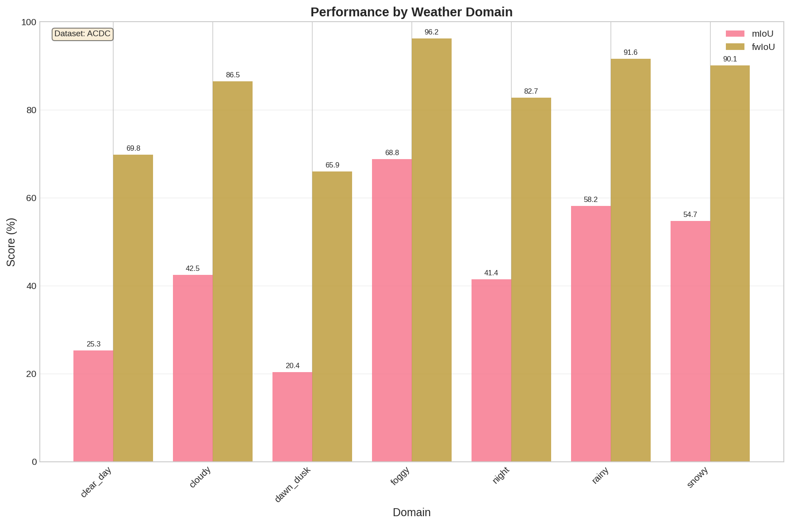
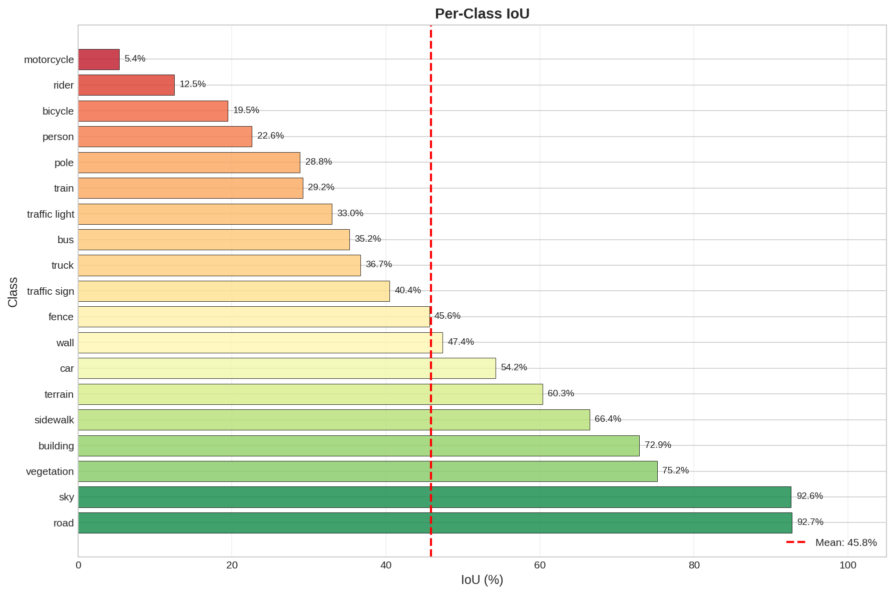
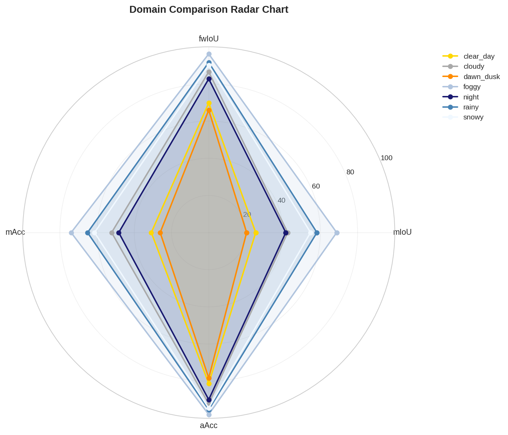

# PROVE Test Result Visualization

This document describes how to generate visualizations from PROVE test results using `test_result_visualizer.py`.

## Overview

The test result visualizer generates publication-quality figures from the detailed test results produced by `fine_grained_test.py`. It supports multiple plot types and can compare results across different models and strategies.

## Prerequisites

```bash
# Install visualization dependencies
pip install matplotlib seaborn pandas
```

## Quick Start

```bash
# Generate all visualizations for a test result
python test_result_visualizer.py --results-dir /path/to/test_results_detailed/timestamp/

# Generate specific plot types
python test_result_visualizer.py --results-dir /path/to/results --plots domain class

# Compare multiple models
python test_result_visualizer.py --compare --results-dirs result1 result2 --labels "Model A" "Model B"
```

## Input Data Structure

The visualizer expects the output from `fine_grained_test.py`:

```
test_results_detailed/
└── 20251210_094301/          # Timestamped folder
    └── results.json           # Overall, per-domain, per-class metrics
```

> **Note:** Older test runs may have separate files (`metrics_summary.json`, `metrics_per_domain.json`, etc.). The current `fine_grained_test.py` outputs a single `results.json`.

## Plot Types

### 1. Domain Metrics Bar Chart (`domain`)

Grouped bar chart showing mIoU and fwIoU for each weather domain.

```bash
python test_result_visualizer.py --results-dir /path/to/results --plots domain
```

**Output**: `figures/domain_metrics.png`



### 2. Per-Class IoU Chart (`class`)

Horizontal bar chart of per-class IoU, color-coded by performance (red-yellow-green gradient).

```bash
python test_result_visualizer.py --results-dir /path/to/results --plots class
```

**Output**: `figures/class_iou.png`, `figures/class_acc.png`



### 3. Domain Radar Chart (`radar`)

Polar chart comparing all domains across multiple metrics (mIoU, fwIoU, mAcc, aAcc).

```bash
python test_result_visualizer.py --results-dir /path/to/results --plots radar
```

**Output**: `figures/domain_radar.png`



### 4. Per-Domain Per-Class Heatmap (`heatmap`)

2D heatmap showing IoU for each class within each domain. Requires full metrics data.

```bash
python test_result_visualizer.py --results-dir /path/to/results --plots heatmap
```

**Output**: `figures/heatmap_iou.png`

### 5. Summary Dashboard (`dashboard`)

Comprehensive 6-panel dashboard with:
- Overall metrics bar chart
- Per-domain performance comparison
- Per-class IoU (sorted)
- Domain radar chart
- Image distribution pie chart
- Best/worst classes comparison

```bash
python test_result_visualizer.py --results-dir /path/to/results --plots dashboard
```

**Output**: `figures/dashboard.png`


### 6. Domain Gap Analysis (`gap`)

Two-panel visualization showing:
- Left: Performance values per domain with reference line
- Right: Performance drop from best domain (domain adaptation gap)

This helps identify which domains suffer the most from domain shift.

```bash
python test_result_visualizer.py --results-dir /path/to/results --plots gap
```

**Output**: `figures/domain_gap_analysis.png`

### 7. Class Frequency vs Performance (`freq`)

Scatter plot showing correlation between class accuracy and IoU with trend line. Helps identify:
- If rare classes have lower performance
- Classes that underperform relative to their frequency
- Overall correlation between accuracy and IoU

```bash
python test_result_visualizer.py --results-dir /path/to/results --plots freq
```

**Output**: `figures/class_freq_performance.png`

### 8. Domain Box Plot Distribution (`boxplot`)

Box plot showing the distribution of per-class IoU within each domain. Helps visualize:
- Variance in class performance per domain
- Outlier classes in each domain
- Median vs mean performance

Requires full per-domain per-class metrics (`metrics_full.json`).

```bash
python test_result_visualizer.py --results-dir /path/to/results --plots boxplot
```

**Output**: `figures/domain_boxplot_iou.png`

### 9. Training Curves (`training`)

Line plots showing training progress:
- Loss curve with smoothed trend line
- Learning rate schedule (if available)

Requires `scalars.json` from MMEngine logging.

```bash
python test_result_visualizer.py --results-dir /path/to/results --plots training
```

**Output**: `figures/training_curves.png`

### 10. Improvement Comparison (`--baseline`)

Two-panel visualization comparing current results to a baseline:
- Left: Side-by-side bar comparison
- Right: Delta chart showing improvement/regression per domain

```bash
python test_result_visualizer.py --results-dir /path/to/results --baseline /path/to/baseline/results
```

**Output**: `figures/improvement_comparison.png`

## Command Line Options

| Option | Description | Default |
|--------|-------------|---------|
| `--results-dir <path>` | Path to test results directory | Required |
| `--output-dir <path>` | Output directory for figures | `results_dir/figures` |
| `--plots <types>` | Plot types (see below) | `all` |
| `--format <fmt>` | Output format: `png`, `pdf`, `svg` | `png` |
| `--dpi <int>` | Figure resolution | `150` |
| `--show` | Display figures interactively | Disabled |
| `--baseline <path>` | Baseline results for improvement comparison | None |

### Available Plot Types

| Plot Type | Description | Output File |
|-----------|-------------|-------------|
| `domain` | Per-domain metrics bar chart | `domain_metrics.png` |
| `class` | Per-class IoU/Acc bar charts | `class_iou.png`, `class_acc.png` |
| `radar` | Multi-metric domain radar chart | `domain_radar.png` |
| `heatmap` | Domain vs class IoU heatmap | `heatmap_iou.png` |
| `dashboard` | Comprehensive 6-panel summary | `dashboard.png` |
| `gap` | Domain gap analysis | `domain_gap_analysis.png` |
| `freq` | Class frequency vs performance | `class_freq_performance.png` |
| `boxplot` | Per-domain IoU distribution | `domain_boxplot_iou.png` |
| `training` | Training curves | `training_curves.png` |
| `all` | Generate all plots | All files |

### Comparison Mode

| Option | Description |
|--------|-------------|
| `--compare` | Enable comparison mode |
| `--results-dirs <paths>` | List of result directories to compare |
| `--labels <names>` | Labels for each result (default: directory names) |

## Python API

```python
from test_result_visualizer import TestResultVisualizer, compare_results

# Single result visualization
visualizer = TestResultVisualizer(
    results_dir='/path/to/test_results_detailed/timestamp/',
    output_dir='/path/to/figures',  # Optional
    figsize=(12, 8),
    dpi=150
)

# Generate individual plots
visualizer.plot_domain_metrics(metrics=['mIoU', 'fwIoU'])
visualizer.plot_class_metrics(metric='IoU', sort_by='value')
visualizer.plot_radar_chart()
visualizer.plot_heatmap(metric='IoU')
visualizer.plot_summary_dashboard()

# New visualization methods
visualizer.plot_domain_gap_analysis()  # Domain gap analysis
visualizer.plot_class_frequency_performance()  # Correlation plot
visualizer.plot_domain_boxplot(metric='IoU')  # Distribution analysis
visualizer.plot_training_curves()  # Training progress
visualizer.plot_improvement_comparison('/path/to/baseline')  # Delta comparison

# Generate all plots
visualizer.generate_all_plots()

# Compare multiple results
compare_results(
    results_dirs=['/path/to/result1', '/path/to/result2'],
    output_dir='/path/to/comparison',
    labels=['Baseline', 'CycleGAN']
)
```

## Customization

### Color Palettes

Domain colors can be customized in the `DOMAIN_COLORS` dictionary:

```python
DOMAIN_COLORS = {
    'clear_day': '#FFD700',      # Gold
    'cloudy': '#A9A9A9',         # Dark Gray
    'dawn_dusk': '#FF8C00',      # Dark Orange
    'foggy': '#B0C4DE',          # Light Steel Blue
    'night': '#191970',          # Midnight Blue
    'rainy': '#4682B4',          # Steel Blue
    'snowy': '#F0F8FF',          # Alice Blue
}
```

### Figure Styles

Available matplotlib styles:
- `seaborn-v0_8-whitegrid` (default)
- `seaborn-v0_8-darkgrid`
- `ggplot`
- `default`

```python
visualizer = TestResultVisualizer(
    results_dir='/path/to/results',
    style='ggplot'
)
```

## Example Workflow

```bash
# 1. Run detailed test
python fine_grained_test.py --config /path/training_config.py \
    --checkpoint /path/iter_80000.pth \
    --dataset ACDC --output-dir /path/test_results_detailed

# 2. Find the timestamped results folder
ls ${AWARE_DATA_ROOT}/WEIGHTS/baseline/acdc/deeplabv3plus_r50/test_results_detailed/

# 3. Generate visualizations
python test_result_visualizer.py \
    --results-dir ${AWARE_DATA_ROOT}/WEIGHTS/baseline/acdc/deeplabv3plus_r50/test_results_detailed/20251210_094301/

# 4. View generated figures
ls ${AWARE_DATA_ROOT}/WEIGHTS/baseline/acdc/deeplabv3plus_r50/test_results_detailed/20251210_094301/figures/
```

## Integration with fine_grained_test.py

You can add visualization generation directly to your testing workflow:

```bash
# Run detailed test and generate visualizations
python fine_grained_test.py --config /path/training_config.py --checkpoint /path/iter_80000.pth \
    --dataset ACDC --output-dir /path/test_results_detailed && \
python test_result_visualizer.py --results-dir $(ls -td ${AWARE_DATA_ROOT}/WEIGHTS/baseline/acdc/deeplabv3plus_r50/test_results_detailed/*/ | head -1)
```

## Output Examples

### Per-Domain Performance (ACDC Dataset)

| Domain | mIoU | fwIoU | Images |
|--------|------|-------|--------|
| foggy | 68.78% | 96.18% | 144 |
| rainy | 58.16% | 91.60% | 162 |
| snowy | 54.72% | 90.11% | 190 |
| cloudy | 42.45% | 86.50% | 217 |
| night | 41.43% | 82.74% | 183 |
| clear_day | 25.28% | 69.83% | 301 |
| dawn_dusk | 20.38% | 65.94% | 16 |

### Per-Class IoU (Top 5)

| Class | IoU |
|-------|-----|
| road | 92.71% |
| sky | 92.60% |
| vegetation | 75.20% |
| building | 72.90% |
| sidewalk | 66.44% |

### Per-Class IoU (Bottom 5)

| Class | IoU |
|-------|-----|
| motorcycle | 5.36% |
| rider | 12.50% |
| bicycle | 19.46% |
| person | 22.60% |
| pole | 28.84% |

## See Also

- [UNIFIED_TESTING.md](UNIFIED_TESTING.md) - Testing documentation
- [UNIFIED_TRAINING.md](UNIFIED_TRAINING.md) - Training documentation
- [fine_grained_test.py](../fine_grained_test.py) - Detailed test script
